# Modelo Entidad-Relación (ER)

## 0. Representación visual del modelo

```mermaid
erDiagram
	reservation_item }o--|| product : references
	return_item }o--|| return : references
	role ||--|| user_role : references
	role_permission ||--|| role : references
	role_permission ||--|| permission : references
	user ||--|| user_role : references
	fiscal_data }o--|| customer : references
	product }o--|| category : references
	product }o--|| brand : references
	service_rate }o--|| service : references
	inventory ||--|| product : references
	inventory_movement }o--|| product : references
	inventory_movement }o--|| user : references
	inventory_incident }o--|| product : references
	inventory_incident }o--|| user : references
	inventory_incident }o--|| user : references
	sale }o--|| customer : references
	sale }o--|| user : references
	sale_item }o--|| sale : references
	sale_item }o--|| product : references
	service ||--o{ sale_item : references
	payment }o--|| sale : references
	payment }o--|| payment_method : references
	ticket ||--|| sale : references
	sale_item }o--|| discount : references
	return }o--|| sale : references
	return }o--|| user : references
	payment }o--|| user : references
	return_item }o--|| sale_item : references
	reservation }o--|| customer : references
	reservation }o--|| user : references
	reservation_item }o--|| reservation : references
	reservation_payment }o--|| reservation : references
	reservation_payment }o--|| payment_method : references
	reservation_payment }o--|| user : references
	product_supplier ||--|| product : references
	product_supplier ||--|| supplier : references
	purchase }o--|| supplier : references
	purchase }o--|| user : references
	purchase_item }o--|| purchase : references
	purchase_item }o--|| product : references
	purchase_incident }o--|| purchase : references
	purchase_incident }o--|| purchase_item : references
	cash_register }o--|| user : references
	cash_movement }o--|| cash_register : references
	cash_movement }o--|| user : references
	cash_closing }o--|| cash_register : references
	cash_closing }o--|| user : references
	invoice }o--|| sale : references
	invoice }o--|| fiscal_data : references
	sale_item ||--o{ invoice : references
	product_interest }o--|| customer : references
	product_interest }o--|| product : references
	business_configuration }o--|| user : references
	audit_record }o--|| user : references

	user {
		BIGINT id
		VARCHAR(50) username
		VARCHAR(255) password_hash
		VARCHAR(100) first_name
		VARCHAR(100) paternal_last_name
		VARCHAR(100) maternal_last_name
		VARCHAR(20) status
		TIMESTAMP created_at
		TIMESTAMP updated_at
	}

	role {
		BIGINT id
		VARCHAR(50) name
		VARCHAR(255) description
		BOOLEAN active
	}

	permission {
		BIGINT id
		VARCHAR(100) name
		VARCHAR(255) description
		BOOLEAN active
	}

	user_role {
		BIGINT user_id
		BIGINT role_id
	}

	role_permission {
		BIGINT role_id
		BIGINT permission_id
	}

	customer {
		BIGINT id
		VARCHAR(100) first_name
		VARCHAR(100) paternal_last_name
		VARCHAR(100) maternal_last_name
		VARCHAR(20) phone
		VARCHAR(254) email
		BOOLEAN active
		TIMESTAMP created_at
		TIMESTAMP updated_at
	}

	fiscal_data {
		BIGINT id
		BIGINT customer_id
		VARCHAR(20) tax_id
		VARCHAR(255) legal_name
		VARCHAR(10) tax_regime
		VARCHAR(5) postal_code
		VARCHAR(10) fiscal_use
		TIMESTAMP created_at
		TIMESTAMP updated_at
	}

	category {
		BIGINT id
		VARCHAR(100) name
		VARCHAR(255) description
		BOOLEAN active
	}

	brand {
		BIGINT id
		VARCHAR(100) name
		VARCHAR(255) description
		BOOLEAN active
	}

	product {
		INTEGER id
		VARCHAR(50) sku
		VARCHAR(50) barcode
		VARCHAR(150) name
		TEXT description
		BIGINT category_id
		BIGINT brand_id
		DECIMAL sale_price
		DECIMAL cost_price
		INTEGER stock_alert_level
		BOOLEAN active
		TIMESTAMP created_at
		TIMESTAMP updated_at
	}

	discount {
		BIGINT id
		VARCHAR(100) name
		VARCHAR(255) type
		DECIMAL value
		JSONB conditions
		TIMESTAMP starts_at
		TIMESTAMP endst_at
		BOOLEAN active
		TIMESTAMP created_at
		TIMESTAMP updated_at
	}

	service {
		BIGINT id
		VARCHAR(100) name
		TEXT description
		BOOLEAN active
		TIMESTAMP created_at
		TIMESTAMP updated_at
	}

	service_rate {
		BIGINT id
		BIGINT service_id
		VARCHAR(100) name
		DECIMAL unit_price
		JSONB configuration
		BOOLEAN active
		TIMESTAMP created_at
		TIMESTAMP updated_at
	}

	inventory {
		BIGINT id
		BIGINT product_id
		INTEGER quantity
		INTEGER reserved_quantity
		TIMESTAMP updated_at
	}

	inventory_movement {
		INTEGER id
		BIGINT product_id
		VARCHAR(30) type
		INTEGER quantity
		VARCHAR(30) reference_type
		BIGINT reference_id
		BIGINT user_id
		VARCHAR(255) reason
		TEXT notes
		TIMESTAMP created_at
	}

	inventory_incident {
		BIGINT id
		BIGINT product_id
		INTEGER system_quantity
		INTEGER physical_quantity
		INTEGER difference
		VARCHAR(255) reason
		VARCHAR(20) status
		BIGINT reported_by
		BIGINT resolved_by
		TEXT notes
		TIMESTAMP created_at
		TIMESTAMP resolved_at
	}

	sale {
		INTEGER id
		BIGINT customer_id
		BIGINT user_id
		VARCHAR(20) status
		DECIMAL subtotal
		DECIMAL discount_total
		DECIMAL tax_total
		DECIMAL total
		TIMESTAMP created_at
		TIMESTAMP completed_at
		TIMESTAMP cancelled_at
	}

	sale_item {
		INTEGER id
		BIGINT sale_id
		BIGINT product_id
		BIGINT service_id
		VARCHAR(255) description
		DECIMAL quantity
		DECIMAL unit_price
		BIGINT discount_id
		VARCHAR(30) discount_type
		DECIMAL discount_value
		DECIMAL discount_amount
		DECIMAL tax
		DECIMAL subtotal
	}

	payment_method {
		BIGINT id
		VARCHAR(50) name
		VARCHAR(30) type
		BOOLEAN active
	}

	payment {
		BIGINT id
		BIGINT sale_id
		BIGINT paymenth_method_id
		DECIMAL amount
		VARCHAR(20) status
		VARCHAR(100) reference
		BIGINT user_id
		TIMESTAMP created_at
	}

	ticket {
		BIGINT id
		BIGINT sale_id
		VARCHAR(50) ticket_number
		TIMESTAMP issued_at
	}

	return {
		BIGINT id
		BIGINT sale_id
		BIGINT user_id
		VARCHAR(30) type
		TEXT reason
		DECIMAL total
		VARCHAR(20) status
		TIMESTAMP created_at
	}

	return_item {
		BIGINT id
		BIGINT return_id
		BIGINT sale_item_id
		DECIMAL quantity
		DECIMAL amount
	}

	reservation {
		BIGINT id
		BIGINT customer_id
		BIGINT user_id
		VARCHAR(20) status
		DECIMAL total
		DECIMAL paid_amount
		DECIMAL due_amount
		DECIMAL minimum_percentage_applied
		DECIMAL cancellation_retention_percentage_applied
		DECIMAL expiration_retention_percentage_applied
		TIMESTAMP reserved_at
		TIMESTAMP expires_at
		TIMESTAMP completed_at
		TIMESTAMP cancelled_at
	}

	reservation_item {
		BIGINT id
		BIGINT reservation_id
		BIGINT product_id
		INTEGER quantity
		DECIMAL unit_price
		DECIMAL subtotal
	}

	reservation_payment {
		BIGINT id
		BIGINT reservation_id
		BIGINT payment_method_id
		DECIMAL amount
		VARCHAR(20) status
		VARCHAR(100) reference
		BIGINT user_id
		TIMESTAMP created_at
	}

	reservation_configuration {
		BIGINT id
		DECIMAL minimum_percentage
		INTEGER expirationd_days
		DECIMAL cancellation_retention_percentage
		DECIMAL expiration_retention_percentage
		BOOLEAN active
		TIMESTAMP created_at
		TIMESTAMP updated_at
	}

	supplier {
		BIGINT id
		VARCHAR(150) name
		VARCHAR(20) phone
		VARCHAR(254) email
		VARCHAR(255) addres
		BOOLEAN active
		TIMESTAMP created_at
		TIMESTAMP updated_at
	}

	product_supplier {
		BIGINT product_id
		BIGINT supplier_id
		VARCHAR(50) supplier_code
		DECIMAL last_purchase_price
		BOOLEAN active
	}

	purchase {
		BIGINT id
		BIGINT supplier_id
		BIGINT user_id
		VARCHAR(20) status
		DECIMAL subtotal
		DECIMAL total
		TIMESTAMP ordered_at
		TIMESTAMP received_at
		TIMESTAMP created_at
	}

	purchase_item {
		BIGINT id
		BIGINT purchase_id
		BIGINT product_id
		INTEGER quantity_ordered
		INTEGER quantity_received
		DECIMAL unit_cost
		DECIMAL subtotal
	}

	purchase_incident {
		BIGINT id
		BIGINT purchase_id
		BIGINT purchase_item_id
		VARCHAR(30) type
		INTEGER quantity
		TEXT description
		VARCHAR(255) resolution
		VARCHAR(20) status
		TIMESTAMP created_at
		TIMESTAMP resolved_at
	}

	cash_register {
		BIGINT id
		BIGINT user_id
		VARCHAR(20) status
		DECIMAL opening_amount
		TIMESTAMP opened_at
		TIMESTAMP closed_at
	}

	cash_movement {
		INTEGER id
		BIGINT cash_register_id
		VARCHAR(30) type
		DECIMAL amount
		VARCHAR(30) reference_type
		BIGINT reference_id
		BIGINT user_id
		TEXT description
		TIMESTAMP created_at
	}

	cash_closing {
		BIGINT id
		BIGINT cash_register_id
		BIGINT user_id
		DECIMAL expected_amount
		DECIMAL actual_amount
		DECIMAL difference
		TEXT observations
		TIMESTAMP created_at
	}

	invoice {
		BIGINT id
		BIGINT sale_id
		BIGINT fiscal_data_id
		VARCHAR(50) provider
		VARCHAR(100) external_id
		VARCHAR(20) status
		TIMESTAMP issued_at
		TEXT error_message
		TIMESTAMP created_at
		TIMESTAMP updated_at
	}

	product_interest {
		BIGINT id
		BIGINT customer_id
		BIGINT product_id
		VARCHAR(150) requested_name
		TEXT notes
		VARCHAR(20) status
		TIMESTAMP created_at
	}

	business_configuration {
		BIGINT id
		VARCHAR(100) key
		TEXT value
		VARCHAR(20) data_type
		VARCHAR(255) description
		BIGINT updated_by
		TIMESTAMP updated_at
	}

	audit_record {
		BIGINT id
		BIGINT user_id
		VARCHAR(30) action
		VARCHAR(255) entity_type
		BIGINT entity_id
		JSONB old_value
		JSONB new_value
		TEXT reason
		TIMESTAMP created_at
	}
```





*Figura 1. Modelo Entidad-Relación del sistema.*

El diagrama anterior representa visualmente el modelo entidad-relación definido para el sistema de gestión de la papelería.

El diagrama constituye la representación visual de las entidades, atributos y relaciones descritas en este documento. Su propósito es facilitar la comprensión de la estructura de datos y permitir una revisión general de las relaciones y cardinalidades antes de la implementación física de la base de datos.

El modelo visual se complementa con la especificación detallada presentada en las siguientes secciones. En ellas se describen las entidades, atributos, relaciones, cardinalidades, restricciones de integridad, mecanismos de auditoría, snapshots históricos y demás reglas que deben considerarse durante la implementación en PostgreSQL.

Tambien puedes ver el diagrama de forma mas clara visitando el siguiente enlace [Modelo ER](https://www.drawdb.app/share/_akUUzW3K6v0BfLtM9_Yry2H) cualquier modificacion no reflejada en la imagen dinamica que aqui se expone, estara actualizada en el 
enlace proporcionado

--

## 1. Propósito

Este documento define el modelo entidad-relación del sistema de gestión para una papelería.

El modelo representa la estructura lógica de los datos, sus entidades, atributos principales, claves primarias, claves foráneas y relaciones.

El **Data Dictionary constituye la fuente principal para la definición de las entidades y sus atributos**. El modelo de dominio proporciona el contexto funcional y las reglas de negocio que justifican las relaciones.

El ER Model sirve como puente entre:

```text
Modelo de dominio
       ↓
Modelo Entidad-Relación
       ↓
Data Dictionary
       ↓
Implementación PostgreSQL
```

El modelo no define todavía:

* Sentencias `CREATE TABLE`.
* Índices físicos.
* Migraciones.
* Implementación de servicios.
* Endpoints.
* Código de aplicación.

Las restricciones de datos deberán mantenerse alineadas con el Data Dictionary.

---

# 2. Fuentes del modelo

El modelo entidad-relación se deriva principalmente de:

1. `data-dictionary.md`
2. `domain-model.md`

Y mantiene trazabilidad con:

3. Contexto de negocio.
4. Reglas de negocio.
5. Glosario.
6. Actores.
7. Requisitos funcionales.
8. Requisitos no funcionales.
9. Casos de uso.

El **Data Dictionary tiene precedencia para nombres técnicos, atributos, tipos de relación, claves y nulabilidad**.

Cuando exista una discrepancia entre documentos, deberá corregirse la documentación correspondiente antes de implementar la base de datos.

---

# 3. Convenciones

## 3.1. Nombres

Las tablas y columnas utilizan:

```text
inglés + snake_case
```

Ejemplo:

```text
Empleado
    ↓
user

Nombre
    ↓
first_name
```

---

## 3.2. Identificadores

Las entidades principales utilizan:

```text
id BIGINT PRIMARY KEY
```

Las tablas intermedias que representan relaciones N:M pueden utilizar claves primarias compuestas.

Ejemplo:

```text
user_role

PK(user_id, role_id)
```

---

## 3.3. Relaciones

Se utilizará la siguiente notación conceptual:

```text
1:1
1:N
N:M
```

Las relaciones N:M deberán estar resueltas mediante una tabla intermedia.

---

# 4. Organización del modelo

El ERD se organiza en los siguientes dominios:

```text
SEGURIDAD
├── user
├── role
├── permission
├── user_role
└── role_permission

CLIENTES
├── customer
└── fiscal_data

CATÁLOGO
├── category
├── brand
├── product
├── service
├── service_rate
└── discount

INVENTARIO
├── inventory
├── inventory_movement
└── inventory_incident

VENTAS
├── sale
├── sale_item
├── payment
├── payment_method
├── ticket
├── return
└── return_item

APARTADOS
├── reservation
├── reservation_item
├── reservation_payment
└── reservation_configuration

COMPRAS
├── supplier
├── product_supplier
├── purchase
├── purchase_item
└── purchase_incident

CAJA
├── cash_register
├── cash_movement
└── cash_closing

FACTURACIÓN
└── invoice

INTERESES Y CONFIGURACIÓN
├── product_interest
└── business_configuration

AUDITORÍA
└── audit_record
```

Estas agrupaciones corresponden a la organización establecida en el Data Dictionary.

---

# 5. Entidades del modelo

## 5.1. Seguridad

### `user`

Representa al empleado autorizado para utilizar el sistema.

```text
user
├── id PK
├── username
├── first_name
├── paternal_last_name
├── maternal_last_name
└── ...
```

Relaciones:

```text
user 1:N user_role
user 1:N sale
user 1:N payment
user 1:N reservation
user 1:N reservation_payment
user 1:N purchase
user 1:N return
user 1:N cash_register
user 1:N cash_movement
user 1:N inventory_movement
user 1:N inventory_incident
user 1:N audit_record
user 1:N business_configuration
```

---

### `role`

Representa un conjunto de permisos.

```text
role
└── id PK
```

Relaciones:

```text
role 1:N user_role
role 1:N role_permission
```

---

### `permission`

Representa una operación que puede ser autorizada.

```text
permission
└── id PK
```

Relación:

```text
permission 1:N role_permission
```

---

### `user_role`

Tabla intermedia entre usuarios y roles.

```text
user_role
├── user_id PK, FK → user.id
└── role_id PK, FK → role.id
```

Clave:

```text
PK(user_id, role_id)
```

Relación conceptual:

```text
user N:M role
```

resuelta mediante:

```text
user_role
```

---

### `role_permission`

Tabla intermedia entre roles y permisos.

```text
role_permission
├── role_id PK, FK → role.id
└── permission_id PK, FK → permission.id
```

Clave:

```text
PK(role_id, permission_id)
```

Relación conceptual:

```text
role N:M permission
```

resuelta mediante:

```text
role_permission
```

---

# 6. Clientes

## 6.1. `customer`

Representa a una persona o entidad que adquiere productos o servicios.

```text
customer
└── id PK
```

Relaciones:

```text
customer 1:N fiscal_data
customer 1:N sale
customer 1:N reservation
customer 1:N product_interest
```

Una venta puede no tener cliente registrado:

```text
customer 0:N sale
```

Por ello:

```text
sale.customer_id
```

es una FK nullable.

---

## 6.2. `fiscal_data`

Representa los datos fiscales asociados a un cliente.

```text
fiscal_data
├── id PK
└── customer_id FK → customer.id
```

Relaciones:

```text
customer 1:N fiscal_data
fiscal_data 1:N invoice
```

---

# 7. Catálogo

## 7.1. `category`

Representa una categoría de productos.

```text
category
└── id PK
```

Relación:

```text
category 1:N product
```

---

## 7.2. `brand`

Representa una marca comercial.

```text
brand
└── id PK
```

Relación:

```text
brand 1:N product
```

---

## 7.3. `product`

Representa un producto físico comercializado.

```text
product
├── id PK
├── category_id FK → category.id
└── brand_id FK → brand.id
```

Relaciones:

```text
category 1:N product
brand 1:N product
product 1:1 inventory
product 1:N inventory_movement
product 1:N inventory_incident
product N:M supplier
product 1:N sale_item
product 1:N reservation_item
product 1:N purchase_item
product 1:N product_interest
```

La relación con proveedores se resuelve mediante:

```text
product_supplier
```

---

## 7.4. `service`

Representa un servicio ofrecido por el negocio.

```text
service
└── id PK
```

Relaciones:

```text
service 1:N service_rate
service 1:N sale_item
```

---

## 7.5. `service_rate`

Representa una tarifa configurable para un servicio.

```text
service_rate
├── id PK
└── service_id FK → service.id
```

Relación:

```text
service 1:N service_rate
```

El precio utilizado en una operación histórica se conserva en `sale_item`, no mediante dependencia del precio actual de `service_rate`.

---

## 7.6. `discount`

Representa una configuración o definición de descuento.

```text
discount
└── id PK
```

Relación:

```text
discount 1:N sale_item
```

El detalle de venta conserva además los valores históricos del descuento aplicado.

---

# 8. Inventario

## 8.1. `inventory`

Representa la existencia actual de un producto.

```text
inventory
├── id PK
├── product_id FK UNIQUE → product.id
├── quantity
└── reserved_quantity
```

Relación:

```text
product 1:1 inventory
```

La existencia disponible se obtiene conceptualmente mediante:

```text
quantity - reserved_quantity
```

La relación 1:1 se implementa mediante la unicidad de `product_id`.

---

## 8.2. `inventory_movement`

Registra cualquier movimiento que modifique las existencias.

```text
inventory_movement
├── id PK
├── product_id FK → product.id
└── user_id FK → user.id
```

Relaciones:

```text
product 1:N inventory_movement
user 1:N inventory_movement
```

Los movimientos no deberán eliminarse físicamente.

---

## 8.3. `inventory_incident`

Registra discrepancias o anomalías de inventario.

```text
inventory_incident
├── id PK
├── product_id FK → product.id
└── user_id FK → user.id
```

Relaciones:

```text
product 1:N inventory_incident
user 1:N inventory_incident
```

---

# 9. Ventas

## 9.1. `sale`

Representa una operación comercial.

```text
sale
├── id PK
├── customer_id FK → customer.id NULL
└── user_id FK → user.id
```

Relaciones:

```text
customer 0:N sale
user 1:N sale
sale 1:N sale_item
sale 1:N payment
sale 1:1 ticket
sale 1:N return
sale 1:N invoice
```

---

## 9.2. `sale_item`

Representa un concepto vendido.

Puede representar un:

```text
product
```

o un:

```text
service
```

Por lo tanto:

```text
sale_item
├── sale_id FK → sale.id
├── product_id FK → product.id
├── service_id FK → service.id
└── discount_id FK → discount.id
```

La regla del modelo es que cada detalle represente exactamente un concepto vendible:

```text
PRODUCT
    XOR
SERVICE
```

Los valores históricos de la operación se almacenan directamente en el detalle:

```text
unit_price
discount_value
discount_amount
subtotal
```

Esto evita que un cambio posterior en el catálogo modifique una venta histórica.

---

## 9.3. `payment`

Representa un pago asociado a una venta.

```text
payment
├── id PK
├── sale_id FK → sale.id
├── payment_method_id FK → payment_method.id
└── user_id FK → user.id
```

Relaciones:

```text
sale 1:N payment
payment_method 1:N payment
user 1:N payment
```

---

## 9.4. `payment_method`

Representa una forma de pago configurable.

```text
payment_method
└── id PK
```

Relaciones:

```text
payment_method 1:N payment
payment_method 1:N reservation_payment
```

---

## 9.5. `ticket`

Representa el comprobante de una venta.

```text
ticket
├── id PK
└── sale_id FK UNIQUE → sale.id
```

Relación:

```text
sale 1:1 ticket
```

La unicidad de `sale_id` evita múltiples tickets para una misma venta dentro del modelo actual.

---

## 9.6. `return`

Representa una devolución total o parcial.

```text
return
├── id PK
├── sale_id FK → sale.id
└── user_id FK → user.id
```

Relaciones:

```text
sale 1:N return
user 1:N return
return 1:N return_item
```

---

## 9.7. `return_item`

Representa un concepto específico devuelto.

```text
return_item
├── id PK
├── return_id FK → return.id
└── sale_item_id FK → sale_item.id
```

Relaciones:

```text
return 1:N return_item
sale_item 1:N return_item
```

Esto permite comprobar que la cantidad devuelta corresponda a un concepto originalmente vendido.

---

# 10. Apartados

## 10.1. `reservation`

Representa un apartado realizado por un cliente.

```text
reservation
├── id PK
├── customer_id FK → customer.id
├── user_id FK → user.id
├── minimum_percentage_applied
├── cancellation_retention_percentage_applied
└── expiration_retention_percentage_applied
```

Relaciones:

```text
customer 1:N reservation
user 1:N reservation
reservation 1:N reservation_item
reservation 1:N reservation_payment
```

Los porcentajes aplicados se almacenan como **snapshot histórico** de la configuración vigente al momento de crear el apartado.

---

## 10.2. `reservation_item`

Representa un producto apartado.

```text
reservation_item
├── id PK
├── reservation_id FK → reservation.id
└── product_id FK → product.id
```

Relaciones:

```text
reservation 1:N reservation_item
product 1:N reservation_item
```

El precio histórico se conserva mediante:

```text
unit_price
```

---

## 10.3. `reservation_payment`

Representa un pago realizado sobre un apartado.

```text
reservation_payment
├── id PK
├── reservation_id FK → reservation.id
├── payment_method_id FK → payment_method.id
└── user_id FK → user.id
```

Relaciones:

```text
reservation 1:N reservation_payment
payment_method 1:N reservation_payment
user 1:N reservation_payment
```

---

## 10.4. `reservation_configuration`

Representa las reglas configurables para los apartados.

```text
reservation_configuration
└── id PK
```

Esta entidad pertenece al conjunto de configuración del negocio.

Su relación con `reservation` no debe utilizarse para recuperar las reglas históricas aplicadas a un apartado.

Los valores históricos se conservan directamente en:

```text
reservation.minimum_percentage_applied
reservation.cancellation_retention_percentage_applied
reservation.expiration_retention_percentage_applied
```

De esta forma, modificar la configuración no altera apartados existentes.

---

# 11. Compras

## 11.1. `supplier`

Representa un proveedor.

```text
supplier
└── id PK
```

Relaciones:

```text
supplier 1:N purchase
supplier N:M product
```

---

## 11.2. `product_supplier`

Resuelve la relación N:M entre productos y proveedores.

```text
product_supplier
├── product_id PK, FK → product.id
└── supplier_id PK, FK → supplier.id
```

Clave:

```text
PK(product_id, supplier_id)
```

Relación conceptual:

```text
product N:M supplier
```

---

## 11.3. `purchase`

Representa una compra realizada a un proveedor.

```text
purchase
├── id PK
├── supplier_id FK → supplier.id
└── user_id FK → user.id
```

Relaciones:

```text
supplier 1:N purchase
user 1:N purchase
purchase 1:N purchase_item
purchase 1:N purchase_incident
```

---

## 11.4. `purchase_item`

Representa un producto incluido en una compra.

```text
purchase_item
├── id PK
├── purchase_id FK → purchase.id
└── product_id FK → product.id
```

Relaciones:

```text
purchase 1:N purchase_item
product 1:N purchase_item
purchase_item 1:N purchase_incident
```

El costo histórico se conserva mediante:

```text
unit_cost
```

La cantidad solicitada y la cantidad recibida se almacenan separadamente.

---

## 11.5. `purchase_incident`

Representa una incidencia relacionada con la recepción de mercancía.

```text
purchase_incident
├── id PK
├── purchase_id FK → purchase.id
└── purchase_item_id FK → purchase_item.id
```

Relaciones:

```text
purchase 1:N purchase_incident
purchase_item 1:N purchase_incident
```

---

# 12. Caja

## 12.1. `cash_register`

Representa una caja operativa.

```text
cash_register
├── id PK
└── user_id FK → user.id
```

Relaciones:

```text
user 1:N cash_register
cash_register 1:N cash_movement
cash_register 1:N cash_closing
```

---

## 12.2. `cash_movement`

Representa una entrada o salida económica.

```text
cash_movement
├── id PK
├── cash_register_id FK → cash_register.id
└── user_id FK → user.id
```

Relaciones:

```text
cash_register 1:N cash_movement
user 1:N cash_movement
```

El movimiento debe poder conservar la operación relacionada cuando corresponda.

---

## 12.3. `cash_closing`

Representa el corte de caja.

```text
cash_closing
├── id PK
└── cash_register_id FK → cash_register.id
```

Relación:

```text
cash_register 1:N cash_closing
```

El corte conserva:

```text
total_expected
total_registered
difference
```

para mantener el historial de conciliación.

---

# 13. Facturación

## 13.1. `invoice`

Representa un documento fiscal asociado a una venta.

```text
invoice
├── id PK
├── sale_id FK → sale.id
└── fiscal_data_id FK → fiscal_data.id
```

Relaciones:

```text
sale 1:N invoice
fiscal_data 1:N invoice
```

Una venta puede tener facturación pendiente, procesándose, emitida, con error o cancelada.

La facturación externa no debe impedir que la venta sea completada.

---

# 14. Intereses y configuración

## 14.1. `product_interest`

Representa el interés de un cliente por un producto disponible o por adquirir.

```text
product_interest
├── id PK
├── customer_id FK → customer.id NULL
└── product_id FK → product.id NULL
```

Relaciones:

```text
customer 1:N product_interest
product 1:N product_interest
```

Ambas relaciones pueden ser opcionales de acuerdo con las reglas del dominio:

* El cliente puede no estar registrado.
* El producto puede no existir todavía.

---

## 14.2. `business_configuration`

Representa parámetros configurables del negocio.

```text
business_configuration
├── id PK
└── user_id FK → user.id
```

Relación:

```text
user 1:N business_configuration
```

Los cambios realizados sobre la configuración deberán poder ser auditados mediante `audit_record`.

---

# 15. Auditoría

## 15.1. `audit_record`

Representa el historial de modificaciones relevantes.

```text
audit_record
├── id PK
└── user_id FK → user.id
```

Relación:

```text
user 1:N audit_record
```

La entidad utiliza referencias lógicas para identificar:

```text
entity_name
entity_id
```

y conserva, cuando corresponda:

```text
old_value
new_value
reason
```

Por su naturaleza histórica, `audit_record` no deberá eliminarse físicamente.

---

# 16. Relaciones completas

El conjunto de relaciones del modelo queda definido de la siguiente manera.

## Seguridad

```text
user 1:N user_role
role 1:N user_role

role 1:N role_permission
permission 1:N role_permission
```

## Clientes

```text
customer 1:N fiscal_data
customer 0:N sale
customer 1:N reservation
customer 1:N product_interest
```

## Catálogo

```text
category 1:N product
brand 1:N product

service 1:N service_rate
service 1:N sale_item

discount 1:N sale_item
```

## Inventario

```text
product 1:1 inventory
product 1:N inventory_movement
product 1:N inventory_incident
```

## Ventas

```text
sale 1:N sale_item
sale 1:N payment
sale 1:1 ticket
sale 1:N return
sale 1:N invoice

product 1:N sale_item
service 1:N sale_item

payment_method 1:N payment
```

## Devoluciones

```text
return 1:N return_item
sale_item 1:N return_item
```

## Apartados

```text
reservation 1:N reservation_item
reservation 1:N reservation_payment

product 1:N reservation_item

payment_method 1:N reservation_payment
```

## Compras

```text
supplier 1:N purchase

purchase 1:N purchase_item
purchase 1:N purchase_incident

purchase_item 1:N purchase_incident

product N:M supplier
```

resuelta mediante:

```text
product_supplier
```

## Caja

```text
cash_register 1:N cash_movement
cash_register 1:N cash_closing
```

## Usuarios y operaciones

```text
user 1:N sale
user 1:N payment
user 1:N reservation
user 1:N reservation_payment
user 1:N purchase
user 1:N return
user 1:N cash_register
user 1:N cash_movement
user 1:N inventory_movement
user 1:N inventory_incident
user 1:N audit_record
user 1:N business_configuration
```

## Facturación

```text
fiscal_data 1:N invoice
```

---

# 17. Reglas estructurales representadas

El ER Model debe permitir representar las siguientes reglas fundamentales.

### 17.1. Cliente opcional en venta

```text
customer 1:N sale
```

con:

```text
sale.customer_id NULL
```

Una venta normal puede existir sin cliente registrado.

---

### 17.2. Producto e inventario

```text
product 1:1 inventory
```

`inventory.product_id` debe ser único.

---

### 17.3. Productos y proveedores

La relación:

```text
product N:M supplier
```

se resuelve mediante:

```text
product_supplier
```

---

### 17.4. Usuario y roles

La relación:

```text
user N:M role
```

se resuelve mediante:

```text
user_role
```

---

### 17.5. Roles y permisos

La relación:

```text
role N:M permission
```

se resuelve mediante:

```text
role_permission
```

---

### 17.6. Venta y conceptos

Una venta contiene uno o más conceptos:

```text
sale 1:N sale_item
```

Cada `sale_item` representa un producto o un servicio.

---

### 17.7. Historial de precios

Los precios utilizados en operaciones históricas no deben depender del precio actual del catálogo.

Se conservan mediante snapshots:

```text
sale_item.unit_price
reservation_item.unit_price
purchase_item.unit_cost
```

---

### 17.8. Historial de descuentos

Los valores aplicados a una venta se conservan directamente en:

```text
sale_item.discount_value
sale_item.discount_amount
```

El cambio posterior de la configuración de `discount` no modifica las ventas históricas.

---

### 17.9. Historial de apartados

Las reglas aplicadas a un apartado se conservan directamente en:

```text
reservation.minimum_percentage_applied
reservation.cancellation_retention_percentage_applied
reservation.expiration_retention_percentage_applied
```

Esto evita depender de la configuración actual.

---

# 18. Integridad histórica

El modelo utiliza tres mecanismos complementarios.

## 18.1. Snapshot

Las operaciones conservan los valores utilizados en el momento de ejecutarse:

```text
sale_item.unit_price
sale_item.discount_value
sale_item.discount_amount

reservation.minimum_percentage_applied
reservation.cancellation_retention_percentage_applied
reservation.expiration_retention_percentage_applied

reservation_item.unit_price

purchase_item.unit_cost
```

---

## 18.2. Historial operativo

Las operaciones importantes permanecen almacenadas:

```text
sale
payment
return
reservation
purchase
inventory_movement
cash_movement
cash_closing
invoice
```

---

## 18.3. Auditoría

Los cambios administrativos relevantes se registran mediante:

```text
audit_record
```

Esto permite diferenciar:

```text
¿Qué ocurrió?
    ↓
Operaciones

¿Qué valor se utilizó?
    ↓
Snapshots

¿Quién modificó la configuración?
    ↓
Audit record
```

Esta separación está establecida en el modelo de datos y permite mantener la información histórica aunque cambie la configuración actual.

---

# 19. Restricciones principales

El ER Model deberá ser compatible con las restricciones definidas en el Data Dictionary.

Entre ellas:

```text
product.sku UNIQUE
product.barcode UNIQUE cuando exista

category.name UNIQUE
brand.name UNIQUE

payment_method.name UNIQUE

user.username UNIQUE
role.name UNIQUE
permission.name UNIQUE

inventory.reserved_quantity <= inventory.quantity

sale_item.quantity > 0
payment.amount > 0
reservation_payment.amount > 0

purchase_item.quantity_ordered > 0
purchase_item.quantity_received >= 0
```

Las restricciones detalladas de columnas permanecen definidas en el Data Dictionary y no deben duplicarse innecesariamente en el ER Model.

---

# 20. Preparación para múltiples sucursales

El modelo actual no agrega artificialmente una entidad `branch`.

Sin embargo, las entidades operativas no deberán diseñarse de forma que impidan incorporar posteriormente una estructura como:

```text
branch
```

Esto es especialmente importante para:

```text
inventory
cash_register
sale
purchase
user
```

La incorporación formal de sucursales será una decisión posterior y deberá documentarse mediante ADR cuando corresponda.

---

# 21. Diagrama ER

El ERD visual deberá representar las 39 entidades del modelo agrupadas por dominio.

La estructura general será:

```text
                    SECURITY
                       │
          ┌────────────┴────────────┐
          │                         │
        USER                       ROLE
          │                         │
          └────── USER_ROLE ────────┘
                                    │
                             ROLE_PERMISSION
                                    │
                               PERMISSION


CUSTOMER ─────── FISCAL_DATA
    │                 │
    ├── SALE ───── INVOICE
    │    │
    │    ├── SALE_ITEM ─── PRODUCT
    │    │       │            │
    │    │       └── SERVICE  ├── INVENTORY
    │    │                    ├── INVENTORY_MOVEMENT
    │    │                    ├── INVENTORY_INCIDENT
    │    │                    └── PRODUCT_SUPPLIER
    │    │
    │    ├── PAYMENT ─── PAYMENT_METHOD
    │    ├── TICKET
    │    └── RETURN ─── RETURN_ITEM
    │
    ├── RESERVATION ─── RESERVATION_ITEM
    │        │
    │        └── RESERVATION_PAYMENT ─── PAYMENT_METHOD
    │
    └── PRODUCT_INTEREST


SUPPLIER ─── PURCHASE ─── PURCHASE_ITEM ─── PRODUCT
                │
                └── PURCHASE_INCIDENT


USER ─── CASH_REGISTER ─── CASH_MOVEMENT
                    │
                    └── CASH_CLOSING


SERVICE ─── SERVICE_RATE

CATEGORY ─── PRODUCT
BRAND ────── PRODUCT
DISCOUNT ─── SALE_ITEM

USER ─── BUSINESS_CONFIGURATION
USER ─── AUDIT_RECORD
```

El diagrama visual deberá organizarse por dominios y utilizar las FK reales como origen de las relaciones.

---

# 22. Consistencia con el Data Dictionary

El ER Model debe considerarse correcto únicamente cuando exista correspondencia entre:

```text
Entidad del ER
      ↕
Tabla del Data Dictionary
      ↕
Columnas
      ↕
PK / FK
      ↕
Cardinalidades
```

El Data Dictionary es el documento definitivo para:

* Nombre de tabla.
* Nombre de columna.
* Tipo de dato.
* Longitud.
* Nullable.
* Primary Key.
* Foreign Key.
* Unique.
* Check.
* Default.
* Restricciones por columna.

El ER Model se concentra principalmente en:

* Entidades.
* Claves.
* Relaciones.
* Cardinalidades.
* Dependencias estructurales.

De esta manera se evita duplicar en el ER Model información que ya pertenece al Data Dictionary.

---

# 23. Estado del modelo

El modelo entidad-relación se considera preparado para pasar a la siguiente etapa cuando:

* Todas las tablas del Data Dictionary estén representadas.
* Todas las FK estén representadas.
* Las relaciones N:M estén resueltas mediante tablas intermedias.
* Las cardinalidades sean consistentes.
* Las relaciones opcionales correspondan con la nulabilidad definida.
* No existan entidades presentes únicamente en el dominio y ausentes del Data Dictionary.
* No existan tablas del Data Dictionary sin representación en el ER Model.

El siguiente paso será validar el ERD visual contra este documento y posteriormente utilizar ambos como base para la definición física de PostgreSQL.
