# Modelo Entidad-Relación (ER)

## 0. Representación visual del modelo

```mermaid
erDiagram
	role ||--|| user_role : references
	role_permission ||--|| role : references
	role_permission ||--|| permission : references
	user ||--|| user_role : references
	fiscal_data }o--|| customer : references
	product }o--|| category : references
	product }o--|| brand : references
	service_rate }o--|| service : references
	inventory ||--|| product : references
	inventory_movement }o--|| product : references
	inventory_movement }o--|| user : references
	inventory_incident }o--|| product : references
	inventory_incident }o--|| user : references
	inventory_incident }o--|| user : references
	sale }o--|| customer : references
	sale }o--|| user : references
	sale_item }o--|| sale : references
	sale_item }o--|| product : references
	service ||--o{ sale_item : references
	payment }o--|| sale : references
	payment }o--|| payment_method : references
	ticket ||--|| sale : references
	sale_item }o--|| discount : references
	return }o--|| sale : references
	return }o--|| user : references
	payment }o--|| user : references
	return_item }o--|| return : references
	return_item }o--|| sale_item : references
	reservation }o--|| customer : references
	reservation }o--|| user : references
	reservation_item }o--|| reservation : references
	reservation_item }o--|| product : references
	reservation_payment }o--|| reservation : references
	reservation_payment }o--|| payment_method : references
	reservation_payment }o--|| user : references
	product_supplier ||--|| product : references
	product_supplier ||--|| supplier : references
	purchase }o--|| supplier : references
	purchase }o--|| user : references
	purchase_item }o--|| purchase : references
	purchase_item }o--|| product : references
	purchase_incident }o--|| purchase : references
	purchase_incident }o--|| purchase_item : references
	cash_register }o--|| user : references
	cash_movement }o--|| cash_register : references
	cash_movement }o--|| user : references
	cash_closing }o--|| cash_register : references
	cash_closing }o--|| user : references
	invoice }o--|| sale : references
	invoice }o--|| fiscal_data : references
	sale_item ||--o{ invoice : references
	product_interest }o--|| customer : references
	product_interest }o--|| product : references
	business_configuration }o--|| user : references
	audit_record }o--|| user : references

	user {
		BIGINT id
		VARCHAR(255) username
		VARCHAR(255) password_hash
		VARCHAR(255) full_name
		VARCHAR(255) status
		TIMESTAMP created_at
		TIMESTAMP updated_at
	}

	role {
		BIGINT id
		VARCHAR(255) name
		VARCHAR(255) description
		BOOLEAN active
	}

	permission {
		BIGINT id
		VARCHAR(255) name
		VARCHAR(255) description
		BOOLEAN active
	}

	user_role {
		BIGINT user_id
		BIGINT role_id
	}

	role_permission {
		BIGINT role_id
		BIGINT permission_id
	}

	customer {
		BIGINT id
		VARCHAR(255) name
		VARCHAR(255) phone
		VARCHAR(255) email
		BOOLEAN active
		TIMESTAMP created_at
		TIMESTAMP updated_at
	}

	fiscal_data {
		BIGINT id
		BIGINT customer_id
		BIGINT tax_id
		VARCHAR(255) legal_name
		VARCHAR(255) tax_regime
		VARCHAR(255) postal_code
		VARCHAR(255) fiscal_code
		TIMESTAMP created_at
		TIMESTAMP updated_at
	}

	category {
		BIGINT id
		VARCHAR(255) name
		VARCHAR(255) description
		BOOLEAN active
	}

	brand {
		BIGINT id
		VARCHAR(255) name
		VARCHAR(255) description
		BOOLEAN active
	}

	product {
		INTEGER id
		VARCHAR(255) sku
		VARCHAR(255) barcode
		VARCHAR(255) name
		TEXT description
		BIGINT category_id
		BIGINT brand_id
		DECIMAL sale_price
		DECIMAL cost_price
		INTEGER stock_alert_level
		BOOLEAN active
		TIMESTAMP created_at
		TIMESTAMP updated_at
	}

	discount {
		BIGINT id
		VARCHAR(255) name
		VARCHAR(255) type
		DECIMAL value
		JSONB conditions
		TIMESTAMP starts_at
		TIMESTAMP endst_at
		BOOLEAN active
		TIMESTAMP created_at
		TIMESTAMP updated_at
	}

	service {
		BIGINT id
		VARCHAR(255) name
		TEXT description
		BOOLEAN active
		TIMESTAMP created_at
		TIMESTAMP updated_at
	}

	service_rate {
		BIGINT id
		BIGINT service_id
		VARCHAR(255) name
		DECIMAL unit_price
		JSONB configuration
		BOOLEAN active
		TIMESTAMP created_at
		TIMESTAMP updated_at
	}

	inventory {
		BIGINT id
		BIGINT product_id
		INTEGER quantity
		INTEGER reserved_quantity
		TIMESTAMP updated_at
	}

	inventory_movement {
		INTEGER id
		BIGINT product_id
		VARCHAR(255) type
		INTEGER quantity
		VARCHAR(255) reference_type
		BIGINT reference_id
		BIGINT user_id
		VARCHAR(255) reason
		TEXT notes
		TIMESTAMP created_at
	}

	inventory_incident {
		INTEGER id
		BIGINT product_id
		INTEGER system_quantity
		INTEGER physical_quantity
		INTEGER difference
		VARCHAR(255) reason
		VARCHAR(255) status
		BIGINT reported_by
		BIGINT resolved_by
		TEXT notes
		TIMESTAMP created_at
		TIMESTAMP resolved_at
	}

	sale {
		INTEGER id
		BIGINT customer_id
		BIGINT user_id
		VARCHAR(255) status
		DECIMAL subtotal
		DECIMAL discount_total
		DECIMAL tax_total
		DECIMAL total
		TIMESTAMP created_at
		TIMESTAMP completed_at
		TIMESTAMP cancelled_at
	}

	sale_item {
		INTEGER id
		BIGINT sale_id
		BIGINT product_id
		BIGINT service_id
		VARCHAR(255) description
		DECIMAL quantity
		DECIMAL unit_price
		BIGINT discount_id
		VARCHAR(255) discount_type
		DECIMAL discount_value
		DECIMAL discount_amount
		DECIMAL tax
		DECIMAL subtotal
	}

	payment_method {
		BIGINT id
		VARCHAR(255) name
		VARCHAR(255) type
		BOOLEAN active
	}

	payment {
		BIGINT id
		BIGINT sale_id
		BIGINT paymenth_method_id
		DECIMAL amount
		VARCHAR(255) status
		VARCHAR(255) reference
		BIGINT user_id
		TIMESTAMP created_at
	}

	ticket {
		BIGINT id
		BIGINT sale_id
		VARCHAR(255) ticket_number
		TIMESTAMP issued_at
	}

	return {
		BIGINT id
		BIGINT sale_id
		BIGINT user_id
		VARCHAR(255) type
		TEXT reason
		DECIMAL total
		VARCHAR(255) status
		TIMESTAMP created_at
	}

	return_item {
		BIGINT id
		BIGINT return_id
		BIGINT sale_item_id
		DECIMAL quantity
		DECIMAL amount
	}

	reservation {
		BIGINT id
		BIGINT customer_id
		BIGINT user_id
		VARCHAR(255) status
		DECIMAL total
		DECIMAL paid_amount
		DECIMAL due_amount
		DECIMAL minimum_percentage_applied
		DECIMAL cancellation_retention_percentage_applied
		DECIMAL expiration_retention_percentage_applied
		TIMESTAMP reserved_at
		TIMESTAMP expires_at
		TIMESTAMP completed_at
		TIMESTAMP cancelled_at
	}

	reservation_item {
		BIGINT id
		BIGINT reservation_id
		BIGINT product_id
		INTEGER quantity
		DECIMAL unit_price
		DECIMAL subtotal
	}

	reservation_payment {
		BIGINT id
		BIGINT reservation_id
		BIGINT payment_method_id
		DECIMAL amount
		VARCHAR(255) status
		VARCHAR(255) reference
		BIGINT user_id
		TIMESTAMP created_at
	}

	reservation_configuration {
		BIGINT id
		DECIMAL minimum_percentage
		INTEGER expirationd_days
		DECIMAL cancellation_retention_percentage
		DECIMAL expiration_retention_percentage
		BOOLEAN active
		TIMESTAMP created_at
		TIMESTAMP updated_at
	}

	supplier {
		BIGINT id
		VARCHAR(255) name
		VARCHAR(255) phone
		VARCHAR(255) email
		TEXT addres
		BOOLEAN active
		TIMESTAMP created_at
		TIMESTAMP updated_at
	}

	product_supplier {
		BIGINT product_id
		BIGINT supplier_id
		VARCHAR(255) supplier_code
		DECIMAL last_purchase_price
		BOOLEAN active
	}

	purchase {
		BIGINT id
		BIGINT supplier_id
		BIGINT user_id
		VARCHAR(255) status
		DECIMAL subtotal
		DECIMAL total
		TIMESTAMP ordered_at
		TIMESTAMP received_at
		TIMESTAMP created_at
	}

	purchase_item {
		BIGINT id
		BIGINT purchase_id
		BIGINT product_id
		INTEGER quantity_ordered
		INTEGER quantity_received
		DECIMAL unit_cost
		DECIMAL subtotal
	}

	purchase_incident {
		BIGINT id
		BIGINT purchase_id
		BIGINT purchase_item_id
		VARCHAR(255) type
		INTEGER quantity
		TEXT description
		VARCHAR(255) resolution
		VARCHAR(255) status
		TIMESTAMP created_at
		TIMESTAMP resolved_at
	}

	cash_register {
		BIGINT id
		BIGINT user_id
		VARCHAR(255) status
		DECIMAL opening_amount
		TIMESTAMP opened_at
		TIMESTAMP closed_at
	}

	cash_movement {
		INTEGER id
		BIGINT cash_register_id
		VARCHAR(255) type
		DECIMAL amount
		VARCHAR(255) reference_type
		BIGINT reference_id
		BIGINT user_id
		TEXT description
		TIMESTAMP created_at
	}

	cash_closing {
		BIGINT id
		BIGINT cash_register_id
		BIGINT user_id
		DECIMAL expected_amount
		DECIMAL actual_amount
		DECIMAL difference
		TEXT observations
		TIMESTAMP created_at
	}

	invoice {
		BIGINT id
		BIGINT sale_id
		BIGINT fiscal_data_id
		VARCHAR(255) provider
		VARCHAR(255) external_id
		VARCHAR(255) status
		TIMESTAMP issued_at
		TEXT error_message
		TIMESTAMP created_at
		TIMESTAMP updated_at
	}

	product_interest {
		BIGINT id
		BIGINT customer_id
		BIGINT product_id
		VARCHAR(255) requested_name
		TEXT notes
		VARCHAR(255) status
		TIMESTAMP created_at
	}

	business_configuration {
		BIGINT id
		VARCHAR(255) key
		TEXT value
		VARCHAR(255) data_type
		TEXT description
		BIGINT updated_by
		TIMESTAMP updated_at
	}

	audit_record {
		BIGINT id
		BIGINT user_id
		VARCHAR(255) action
		VARCHAR(255) entity_type
		BIGINT entity_id
		JSONB old_value
		JSONB new_value
		TEXT reason
		TIMESTAMP created_at
	}
```





*Figura 1. Modelo Entidad-Relación del sistema.*

El diagrama anterior representa visualmente el modelo entidad-relación definido para el sistema de gestión de la papelería.

El diagrama constituye la representación visual de las entidades, atributos y relaciones descritas en este documento. Su propósito es facilitar la comprensión de la estructura de datos y permitir una revisión general de las relaciones y cardinalidades antes de la implementación física de la base de datos.

El modelo visual se complementa con la especificación detallada presentada en las siguientes secciones. En ellas se describen las entidades, atributos, relaciones, cardinalidades, restricciones de integridad, mecanismos de auditoría, snapshots históricos y demás reglas que deben considerarse durante la implementación en PostgreSQL.

Tambien puedes ver el diagrama de forma mas clara visitando el siguiente enlace [Modelo ER](https://www.drawdb.app/share/_akUUzW3K6v0BfLtM9_Yry2H) cualquier modificacion no reflejada en la imagen dinamica que aqui se expone, estara actualizada en el 
enlace proporcionado

---

## 1. Propósito

Este documento define el modelo entidad-relación de la base de datos para el sistema de gestión de la papelería.

El modelo se deriva de:

* Contexto de negocio.
* Reglas de negocio.
* Glosario.
* Actores.
* Requisitos funcionales.
* Requisitos no funcionales.
* Casos de uso.
* Modelo de dominio.

El objetivo es establecer la estructura persistente del sistema, sus entidades, atributos, relaciones, cardinalidades y principales restricciones de integridad.

El modelo está diseñado para PostgreSQL y busca mantener:

* Integridad referencial.
* Consistencia de la información.
* Trazabilidad de operaciones.
* Conservación de información histórica.
* Configurabilidad del negocio.
* Capacidad de auditoría.
* Preparación para crecimiento futuro.
* Independencia de los registros históricos respecto a cambios posteriores en la configuración.

---

# 2. Principios de diseño

El modelo sigue los siguientes principios.

## 2.1. La información histórica no debe depender de la configuración actual

Una operación histórica no debe cambiar de significado porque posteriormente cambie una configuración.

Por ejemplo:

> Un descuento de estudiante era del 15% cuando se realizó una venta.

Si posteriormente pasa a ser del 18%, la venta histórica debe continuar mostrando que recibió un descuento del 15%.

Por esta razón, las operaciones almacenan los valores utilizados en el momento de su ejecución.

---

## 2.2. Las configuraciones son modificables

Los valores configurables del negocio no deben estar hard-coded.

Entre ellos:

* Nivel de alerta de stock.
* Tarifas de servicios.
* Descuentos.
* Formas de pago.
* Reglas de apartados.
* Categorías.
* Configuración general del negocio.

Estos valores pueden cambiar desde el sistema.

---

## 2.3. Los cambios importantes deben ser auditables

Las modificaciones importantes deben permitir conocer:

* Quién realizó el cambio.
* Cuándo ocurrió.
* Qué entidad fue modificada.
* Qué valor tenía anteriormente.
* Qué valor tiene después del cambio.
* Motivo del cambio, cuando corresponda.

Esto se centraliza mediante `audit_record`.

---

## 2.4. Las operaciones históricas no deben eliminarse físicamente

Las siguientes operaciones deben conservarse:

* Ventas.
* Pagos.
* Devoluciones.
* Movimientos de inventario.
* Movimientos de caja.
* Cortes de caja.
* Compras.
* Apartados.
* Registros de auditoría.

Cuando sea necesario cancelar una operación, debe registrarse su estado correspondiente en lugar de eliminar físicamente el registro.

---

## 2.5. Snapshot histórico

Cuando una operación depende de una configuración que puede cambiar posteriormente, la operación debe conservar los valores utilizados en ese momento.

Ejemplos:

* Precio de venta utilizado.
* Descuento aplicado.
* Porcentaje de descuento.
* Reglas utilizadas para un apartado.
* Precio de compra.
* Condiciones relevantes de una operación.

---

# 3. Convenciones

## 3.1. Nombres

La documentación utiliza nombres en español.

Los nombres técnicos de tablas y columnas utilizan inglés en `snake_case`.

Ejemplo:

> Producto (`product`)

---

## 3.2. Identificadores

Las entidades utilizan:

```text
id BIGINT
```

como clave primaria, salvo tablas intermedias que utilicen claves compuestas cuando corresponda.

---

## 3.3. Relaciones

Las claves foráneas siguen la convención:

```text
<entity>_id
```

Ejemplo:

```text
customer_id
product_id
sale_id
```

---

# 4. Seguridad y control de acceso

## 4.1. Usuario (`user`)

Representa a una persona que utiliza directamente el sistema.

### Atributos

| Campo         | Tipo      | Descripción                           |
| ------------- | --------- | ------------------------------------- |
| id            | BIGINT PK | Identificador                         |
| username      | VARCHAR   | Nombre de usuario                     |
| password_hash | VARCHAR   | Contraseña almacenada de forma segura |
| full_name     | VARCHAR   | Nombre completo                       |
| status        | VARCHAR   | Estado del usuario                    |
| created_at    | TIMESTAMP | Fecha de creación                     |
| updated_at    | TIMESTAMP | Última actualización                  |

### Relaciones

* `user` 1:N `user_role`
* `user` 1:N `sale`
* `user` 1:N `payment`
* `user` 1:N `inventory_movement`
* `user` 1:N `cash_movement`
* `user` 1:N `cash_register`
* `user` 1:N `cash_closing`
* `user` 1:N `reservation`
* `user` 1:N `reservation_payment`
* `user` 1:N `purchase`
* `user` 1:N `return`
* `user` 1:N `audit_record`

Un usuario puede ser desactivado sin eliminar su historial.

---

# 5. Roles

## 5.1. Rol (`role`)

Representa un conjunto de permisos.

### Atributos

| Campo       | Tipo           |
| ----------- | -------------- |
| id          | BIGINT PK      |
| name        | VARCHAR UNIQUE |
| description | VARCHAR        |
| active      | BOOLEAN        |

### Relaciones

* `role` 1:N `user_role`
* `role` 1:N `role_permission`

---

## 5.2. Permiso (`permission`)

Representa una acción autorizada dentro del sistema.

### Atributos

| Campo       | Tipo           |
| ----------- | -------------- |
| id          | BIGINT PK      |
| name        | VARCHAR UNIQUE |
| description | VARCHAR        |
| active      | BOOLEAN        |

### Relaciones

* `permission` 1:N `role_permission`

---

## 5.3. Usuario-Rol (`user_role`)

Tabla intermedia para la relación N:M entre usuarios y roles.

### Atributos

| Campo   | Tipo          |
| ------- | ------------- |
| user_id | BIGINT PK, FK |
| role_id | BIGINT PK, FK |

### Clave primaria

```text
PK(user_id, role_id)
```

---

## 5.4. Rol-Permiso (`role_permission`)

Tabla intermedia para la relación N:M entre roles y permisos.

### Atributos

| Campo         | Tipo          |
| ------------- | ------------- |
| role_id       | BIGINT PK, FK |
| permission_id | BIGINT PK, FK |

### Clave primaria

```text
PK(role_id, permission_id)
```

---

# 6. Clientes

## 6.1. Cliente (`customer`)

Representa a una persona o entidad que adquiere productos o servicios.

### Atributos

| Campo      | Tipo      |
| ---------- | --------- |
| id         | BIGINT PK |
| name       | VARCHAR   |
| phone      | VARCHAR   |
| email      | VARCHAR   |
| active     | BOOLEAN   |
| created_at | TIMESTAMP |
| updated_at | TIMESTAMP |

### Relaciones

* `customer` 1:N `fiscal_data`
* `customer` 1:N `sale`
* `customer` 1:N `reservation`
* `customer` 1:N `product_interest`

Una venta puede realizarse sin cliente registrado.

Por lo tanto:

```text
sale.customer_id
```

es nullable.

---

## 6.2. Datos fiscales (`fiscal_data`)

Contiene información fiscal de un cliente.

### Atributos

| Campo       | Tipo      |
| ----------- | --------- |
| id          | BIGINT PK |
| customer_id | BIGINT FK |
| tax_id      | VARCHAR   |
| legal_name  | VARCHAR   |
| tax_regime  | VARCHAR   |
| postal_code | VARCHAR   |
| fiscal_use  | VARCHAR   |
| created_at  | TIMESTAMP |
| updated_at  | TIMESTAMP |

### Relaciones

* `customer` 1:N `fiscal_data`
* `fiscal_data` 1:N `invoice`

Los datos fiscales tienen acceso restringido.

---

# 7. Catálogo

## 7.1. Categoría (`category`)

### Atributos

| Campo       | Tipo           |
| ----------- | -------------- |
| id          | BIGINT PK      |
| name        | VARCHAR UNIQUE |
| description | VARCHAR        |
| active      | BOOLEAN        |

### Relaciones

```text
category 1:N product
```

---

## 7.2. Marca (`brand`)

### Atributos

| Campo       | Tipo           |
| ----------- | -------------- |
| id          | BIGINT PK      |
| name        | VARCHAR UNIQUE |
| description | VARCHAR        |
| active      | BOOLEAN        |

### Relaciones

```text
brand 1:N product
```

---

# 8. Productos

## 8.1. Producto (`product`)

Representa un artículo comercializado por la papelería.

### Atributos

| Campo             | Tipo           | Descripción                  |
| ----------------- | -------------- | ---------------------------- |
| id                | BIGINT PK      | Identificador                |
| sku               | VARCHAR UNIQUE | Código interno               |
| barcode           | VARCHAR UNIQUE | Código de barras             |
| name              | VARCHAR        | Nombre                       |
| description       | TEXT           | Descripción                  |
| category_id       | BIGINT FK      | Categoría                    |
| brand_id          | BIGINT FK      | Marca                        |
| sale_price        | DECIMAL        | Precio actual                |
| cost_price        | DECIMAL        | Costo actual                 |
| stock_alert_level | INTEGER        | Nivel configurable de alerta |
| active            | BOOLEAN        | Estado                       |
| created_at        | TIMESTAMP      | Creación                     |
| updated_at        | TIMESTAMP      | Actualización                |

### Relaciones

* `category` 1:N `product`
* `brand` 1:N `product`
* `product` 1:1 `inventory`
* `product` 1:N `inventory_movement`
* `product` 1:N `inventory_incident`
* `product` N:M `supplier` mediante `product_supplier`
* `product` 1:N `sale_item`
* `product` 1:N `reservation_item`
* `product` 1:N `purchase_item`
* `product` 1:N `product_interest`

### Auditoría e historial

El precio actual del producto puede cambiar.

Sin embargo, las operaciones históricas deben conservar el precio utilizado:

* `sale_item.unit_price`
* `purchase_item.unit_cost`
* `reservation_item.unit_price`

Los cambios realizados al producto deben registrarse mediante `audit_record`.

---

# 9. Servicios

## 9.1. Servicio (`service`)

Representa servicios ofrecidos por la papelería.

Ejemplos:

* Copias.
* Impresiones.
* Escaneos.
* Engargolados.
* Enmicados.

### Atributos

| Campo       | Tipo      |
| ----------- | --------- |
| id          | BIGINT PK |
| name        | VARCHAR   |
| description | TEXT      |
| active      | BOOLEAN   |
| created_at  | TIMESTAMP |
| updated_at  | TIMESTAMP |

### Relaciones

* `service` 1:N `service_rate`
* `service` 1:N `sale_item`

---

## 9.2. Tarifa de servicio (`service_rate`)

Permite configurar diferentes tarifas para un mismo servicio.

### Atributos

| Campo         | Tipo      |
| ------------- | --------- |
| id            | BIGINT PK |
| service_id    | BIGINT FK |
| name          | VARCHAR   |
| unit_price    | DECIMAL   |
| configuration | JSONB     |
| active        | BOOLEAN   |
| created_at    | TIMESTAMP |
| updated_at    | TIMESTAMP |

`configuration` puede almacenar reglas como:

* Blanco y negro.
* Color.
* Tamaño de papel.
* Cantidad.
* Otras condiciones configurables.

### Historial

El precio utilizado en una venta debe conservarse en `sale_item.unit_price`.

Los cambios de tarifas deben registrarse mediante `audit_record`.

---

# 10. Inventario

## 10.1. Inventario (`inventory`)

Representa la existencia actual de un producto.

### Atributos

| Campo             | Tipo             |
| ----------------- | ---------------- |
| id                | BIGINT PK        |
| product_id        | BIGINT UNIQUE FK |
| quantity          | INTEGER          |
| reserved_quantity | INTEGER          |
| updated_at        | TIMESTAMP        |

### Relaciones

```text
product 1:1 inventory
```

### Restricciones

```text
quantity >= 0
reserved_quantity >= 0
reserved_quantity <= quantity
```

La existencia disponible conceptualmente es:

```text
quantity - reserved_quantity
```

---

# 11. Movimientos de inventario

## 11.1. Movimiento de inventario (`inventory_movement`)

Registra cualquier modificación de existencia.

### Atributos

| Campo          | Tipo      |
| -------------- | --------- |
| id             | BIGINT PK |
| product_id     | BIGINT FK |
| type           | VARCHAR   |
| quantity       | INTEGER   |
| reference_type | VARCHAR   |
| reference_id   | BIGINT    |
| user_id        | BIGINT FK |
| reason         | VARCHAR   |
| notes          | TEXT      |
| created_at     | TIMESTAMP |

### Relaciones

* `product` 1:N `inventory_movement`
* `user` 1:N `inventory_movement`

Los movimientos no deben eliminarse físicamente.

---

# 12. Incidencias de inventario

## 12.1. Incidencia de inventario (`inventory_incident`)

Registra diferencias entre el inventario del sistema y el inventario físico.

### Atributos

| Campo             | Tipo      |
| ----------------- | --------- |
| id                | BIGINT PK |
| product_id        | BIGINT FK |
| system_quantity   | INTEGER   |
| physical_quantity | INTEGER   |
| difference        | INTEGER   |
| reason            | VARCHAR   |
| status            | VARCHAR   |
| reported_by       | BIGINT FK |
| resolved_by       | BIGINT FK |
| notes             | TEXT      |
| created_at        | TIMESTAMP |
| resolved_at       | TIMESTAMP |

### Relaciones

* `product` 1:N `inventory_incident`
* `user` 1:N mediante `reported_by`
* `user` 1:N mediante `resolved_by`

---

# 13. Ventas

## 13.1. Venta (`sale`)

Representa una operación comercial.

### Atributos

| Campo          | Tipo           |
| -------------- | -------------- |
| id             | BIGINT PK      |
| customer_id    | BIGINT FK NULL |
| user_id        | BIGINT FK      |
| status         | VARCHAR        |
| subtotal       | DECIMAL        |
| discount_total | DECIMAL        |
| tax_total      | DECIMAL        |
| total          | DECIMAL        |
| created_at     | TIMESTAMP      |
| completed_at   | TIMESTAMP      |
| cancelled_at   | TIMESTAMP      |

### Relaciones

* `customer` 1:N `sale`
* `user` 1:N `sale`
* `sale` 1:N `sale_item`
* `sale` 1:N `payment`
* `sale` 1:1 `ticket`
* `sale` 1:N `return`
* `sale` 1:N `invoice`

### Reglas

Una venta:

* Puede no tener cliente.
* Debe contener al menos un artículo.
* Una venta completada debe tener pago confirmado.
* No debe eliminarse físicamente.
* Puede cambiar a estado cancelado.

---

# 14. Detalle de venta

## 14.1. Detalle de venta (`sale_item`)

Representa un producto o servicio vendido.

### Atributos

| Campo           | Tipo           |
| --------------- | -------------- |
| id              | BIGINT PK      |
| sale_id         | BIGINT FK      |
| product_id      | BIGINT FK NULL |
| service_id      | BIGINT FK NULL |
| description     | VARCHAR        |
| quantity        | DECIMAL        |
| unit_price      | DECIMAL        |
| discount_id     | BIGINT FK NULL |
| discount_type   | VARCHAR        |
| discount_value  | DECIMAL        |
| discount_amount | DECIMAL        |
| tax             | DECIMAL        |
| subtotal        | DECIMAL        |

### Relaciones

* `sale` 1:N `sale_item`
* `product` 1:N `sale_item`
* `service` 1:N `sale_item`
* `discount` 1:N `sale_item`

### Restricción

Un `sale_item` debe referenciar:

```text
product_id
```

o:

```text
service_id
```

pero no ambos.

---

## 14.2. Snapshot del precio

`unit_price` representa el precio utilizado en el momento de la venta.

No debe recalcularse consultando `product.sale_price`.

Por ejemplo:

```text
Precio actual del producto: $120

Venta histórica:
unit_price = $100
```

Si posteriormente el producto pasa a $120, la venta histórica permanece en $100.

---

## 14.3. Snapshot del descuento

El `discount_id` identifica qué descuento se aplicó.

Pero también se conservan:

```text
discount_type
discount_value
discount_amount
```

Esto permite saber exactamente qué ocurrió en la venta.

Ejemplo:

```text
discount_id = 2
discount_value = 15
discount_amount = 15
```

Aunque actualmente el descuento número 2 sea 18%.

Esto evita que las ventas históricas dependan de la configuración actual.

---

# 15. Métodos de pago

## 15.1. Método de pago (`payment_method`)

### Atributos

| Campo  | Tipo           |
| ------ | -------------- |
| id     | BIGINT PK      |
| name   | VARCHAR UNIQUE |
| type   | VARCHAR        |
| active | BOOLEAN        |

Ejemplos:

* Efectivo.
* Tarjeta.
* Transferencia.

---

# 16. Pagos

## 16.1. Pago (`payment`)

### Atributos

| Campo             | Tipo      |
| ----------------- | --------- |
| id                | BIGINT PK |
| sale_id           | BIGINT FK |
| payment_method_id | BIGINT FK |
| amount            | DECIMAL   |
| status            | VARCHAR   |
| reference         | VARCHAR   |
| user_id           | BIGINT FK |
| created_at        | TIMESTAMP |

### Relaciones

* `sale` 1:N `payment`
* `payment_method` 1:N `payment`
* `user` 1:N `payment`

Los pagos no deben eliminarse físicamente.

La referencia permite almacenar información de una transacción externa cuando exista.

---

# 17. Tickets

## 17.1. Ticket (`ticket`)

### Atributos

| Campo         | Tipo             |
| ------------- | ---------------- |
| id            | BIGINT PK        |
| sale_id       | BIGINT UNIQUE FK |
| ticket_number | VARCHAR UNIQUE   |
| issued_at     | TIMESTAMP        |

### Relación

```text
sale 1:1 ticket
```

El ticket se genera después de registrar el pago.

---

# 18. Descuentos

## 18.1. Descuento (`discount`)

Representa una configuración comercial de descuento.

### Atributos

| Campo      | Tipo      |
| ---------- | --------- |
| id         | BIGINT PK |
| name       | VARCHAR   |
| type       | VARCHAR   |
| value      | DECIMAL   |
| conditions | JSONB     |
| starts_at  | TIMESTAMP |
| ends_at    | TIMESTAMP |
| active     | BOOLEAN   |
| created_at | TIMESTAMP |
| updated_at | TIMESTAMP |

Ejemplos:

* Estudiantes.
* Tercera edad.
* Cliente frecuente.
* Promoción especial.

Dos descuentos pueden tener exactamente el mismo porcentaje pero representar reglas diferentes.

Por ejemplo:

```text
Descuento estudiante = 15%
Descuento tercera edad = 15%
```

Son descuentos diferentes.

### Relaciones

```text
discount 1:N sale_item
```

### Historial

Los cambios de un descuento se registran mediante `audit_record`.

Además, `sale_item` conserva:

* `discount_id`
* `discount_type`
* `discount_value`
* `discount_amount`

Por lo tanto:

* `discount` representa la configuración.
* `sale_item` representa lo que realmente se aplicó.
* `audit_record` representa cómo cambió la configuración.

---

# 19. Devoluciones

## 19.1. Devolución (`return`)

### Atributos

| Campo      | Tipo      |
| ---------- | --------- |
| id         | BIGINT PK |
| sale_id    | BIGINT FK |
| user_id    | BIGINT FK |
| type       | VARCHAR   |
| reason     | TEXT      |
| total      | DECIMAL   |
| status     | VARCHAR   |
| created_at | TIMESTAMP |

### Relaciones

* `sale` 1:N `return`
* `user` 1:N `return`
* `return` 1:N `return_item`

Una venta puede tener múltiples devoluciones parciales.

La venta original nunca se elimina.

---

## 19.2. Detalle de devolución (`return_item`)

### Atributos

| Campo        | Tipo      |
| ------------ | --------- |
| id           | BIGINT PK |
| return_id    | BIGINT FK |
| sale_item_id | BIGINT FK |
| quantity     | DECIMAL   |
| amount       | DECIMAL   |

### Relaciones

* `return` 1:N `return_item`
* `sale_item` 1:N `return_item`

### Restricción

La cantidad total devuelta de un `sale_item` no puede superar la cantidad originalmente vendida.

---

# 20. Apartados

## 20.1. Apartado (`reservation`)

Representa una reserva de productos realizada por un cliente.

### Atributos

| Campo                                     | Tipo      |
| ----------------------------------------- | --------- |
| id                                        | BIGINT PK |
| customer_id                               | BIGINT FK |
| user_id                                   | BIGINT FK |
| status                                    | VARCHAR   |
| total                                     | DECIMAL   |
| paid_amount                               | DECIMAL   |
| due_amount                                | DECIMAL   |
| minimum_percentage_applied                | DECIMAL   |
| cancellation_retention_percentage_applied | DECIMAL   |
| expiration_retention_percentage_applied   | DECIMAL   |
| reserved_at                               | TIMESTAMP |
| expires_at                                | TIMESTAMP |
| completed_at                              | TIMESTAMP |
| cancelled_at                              | TIMESTAMP |

### Relaciones

* `customer` 1:N `reservation`
* `user` 1:N `reservation`
* `reservation` 1:N `reservation_item`
* `reservation` 1:N `reservation_payment`

Un apartado requiere un cliente registrado.

---

# 21. Snapshot de reglas del apartado

Esta sección es especialmente importante para auditoría.

Cuando se crea un apartado, el sistema copia las reglas vigentes en:

```text
minimum_percentage_applied
cancellation_retention_percentage_applied
expiration_retention_percentage_applied
```

Por ejemplo:

```text
Configuración actual:

Anticipo mínimo: 30%
Cancelación: 15%
Vencimiento: 30%
```

Al crear el apartado:

```text
reservation

minimum_percentage_applied = 30
cancellation_retention_percentage_applied = 15
expiration_retention_percentage_applied = 30
```

Si posteriormente la configuración cambia:

```text
Anticipo mínimo: 40%
Cancelación: 10%
Vencimiento: 25%
```

el apartado anterior continúa utilizando:

```text
30%
15%
30%
```

Esto garantiza que una modificación futura no altere retrospectivamente las reglas de una operación existente.

---

# 22. Detalle de apartado

## 22.1. Detalle de apartado (`reservation_item`)

### Atributos

| Campo          | Tipo      |
| -------------- | --------- |
| id             | BIGINT PK |
| reservation_id | BIGINT FK |
| product_id     | BIGINT FK |
| quantity       | INTEGER   |
| unit_price     | DECIMAL   |
| subtotal       | DECIMAL   |

### Relaciones

* `reservation` 1:N `reservation_item`
* `product` 1:N `reservation_item`

`unit_price` conserva el precio utilizado cuando se creó el apartado.

---

# 23. Pagos de apartados

## 23.1. Pago de apartado (`reservation_payment`)

### Atributos

| Campo             | Tipo      |
| ----------------- | --------- |
| id                | BIGINT PK |
| reservation_id    | BIGINT FK |
| payment_method_id | BIGINT FK |
| amount            | DECIMAL   |
| status            | VARCHAR   |
| reference         | VARCHAR   |
| user_id           | BIGINT FK |
| created_at        | TIMESTAMP |

### Relaciones

* `reservation` 1:N `reservation_payment`
* `payment_method` 1:N `reservation_payment`
* `user` 1:N `reservation_payment`

Un apartado puede tener múltiples pagos.

---

# 24. Configuración de apartados

## 24.1. Configuración de apartados (`reservation_configuration`)

Representa las reglas actuales para apartados.

### Atributos

| Campo                             | Tipo      |
| --------------------------------- | --------- |
| id                                | BIGINT PK |
| minimum_percentage                | DECIMAL   |
| expiration_days                   | INTEGER   |
| cancellation_retention_percentage | DECIMAL   |
| expiration_retention_percentage   | DECIMAL   |
| active                            | BOOLEAN   |
| created_at                        | TIMESTAMP |
| updated_at                        | TIMESTAMP |

### Ejemplo

```text
minimum_percentage = 30
expiration_days = 7
cancellation_retention_percentage = 15
expiration_retention_percentage = 30
```

Estos valores son configurables.

No deben estar hard-coded.

### Historial

Los cambios realizados sobre esta configuración deben registrarse en `audit_record`.

Los apartados existentes conservan además sus propios valores mediante:

```text
minimum_percentage_applied
cancellation_retention_percentage_applied
expiration_retention_percentage_applied
```

---

# 25. Proveedores

## 25.1. Proveedor (`supplier`)

### Atributos

| Campo      | Tipo      |
| ---------- | --------- |
| id         | BIGINT PK |
| name       | VARCHAR   |
| phone      | VARCHAR   |
| email      | VARCHAR   |
| address    | TEXT      |
| active     | BOOLEAN   |
| created_at | TIMESTAMP |
| updated_at | TIMESTAMP |

### Relaciones

* `supplier` 1:N `purchase`
* `supplier` N:M `product` mediante `product_supplier`

---

# 26. Producto-Proveedor

## 26.1. Relación producto-proveedor (`product_supplier`)

### Atributos

| Campo               | Tipo          |
| ------------------- | ------------- |
| product_id          | BIGINT PK, FK |
| supplier_id         | BIGINT PK, FK |
| supplier_code       | VARCHAR       |
| last_purchase_price | DECIMAL       |
| active              | BOOLEAN       |

### Clave primaria

```text
PK(product_id, supplier_id)
```

### Historial

`last_purchase_price` representa el valor actual/conocido.

El historial real de precios de compra se conserva mediante `purchase_item.unit_cost`.

Por lo tanto, si un proveedor vende:

```text
Enero: $8
Marzo: $9
Junio: $11
```

cada compra conserva su precio histórico.

---

# 27. Compras

## 27.1. Compra (`purchase`)

### Atributos

| Campo       | Tipo      |
| ----------- | --------- |
| id          | BIGINT PK |
| supplier_id | BIGINT FK |
| user_id     | BIGINT FK |
| status      | VARCHAR   |
| subtotal    | DECIMAL   |
| total       | DECIMAL   |
| ordered_at  | TIMESTAMP |
| received_at | TIMESTAMP |
| created_at  | TIMESTAMP |

### Relaciones

* `supplier` 1:N `purchase`
* `user` 1:N `purchase`
* `purchase` 1:N `purchase_item`
* `purchase` 1:N `purchase_incident`

---

# 28. Detalle de compra

## 28.1. Detalle de compra (`purchase_item`)

### Atributos

| Campo             | Tipo      |
| ----------------- | --------- |
| id                | BIGINT PK |
| purchase_id       | BIGINT FK |
| product_id        | BIGINT FK |
| quantity_ordered  | INTEGER   |
| quantity_received | INTEGER   |
| unit_cost         | DECIMAL   |
| subtotal          | DECIMAL   |

### Relaciones

* `purchase` 1:N `purchase_item`
* `product` 1:N `purchase_item`

`unit_cost` representa el costo histórico utilizado en esa compra.

---

# 29. Incidencias de compras

## 29.1. Incidencia de compra (`purchase_incident`)

Registra mercancía:

* Faltante.
* Dañada.
* Incorrecta.
* Con diferencias respecto al pedido.

### Atributos

| Campo            | Tipo      |
| ---------------- | --------- |
| id               | BIGINT PK |
| purchase_id      | BIGINT FK |
| purchase_item_id | BIGINT FK |
| type             | VARCHAR   |
| quantity         | INTEGER   |
| description      | TEXT      |
| resolution       | VARCHAR   |
| status           | VARCHAR   |
| created_at       | TIMESTAMP |
| resolved_at      | TIMESTAMP |

### Relaciones

* `purchase` 1:N `purchase_incident`
* `purchase_item` 1:N `purchase_incident`

---

# 30. Caja

## 30.1. Caja (`cash_register`)

Representa una sesión de caja.

### Atributos

| Campo          | Tipo      |
| -------------- | --------- |
| id             | BIGINT PK |
| user_id        | BIGINT FK |
| status         | VARCHAR   |
| opening_amount | DECIMAL   |
| opened_at      | TIMESTAMP |
| closed_at      | TIMESTAMP |

### Relaciones

* `user` 1:N `cash_register`
* `cash_register` 1:N `cash_movement`
* `cash_register` 1:N `cash_closing`

---

# 31. Movimientos de caja

## 31.1. Movimiento de caja (`cash_movement`)

### Atributos

| Campo            | Tipo      |
| ---------------- | --------- |
| id               | BIGINT PK |
| cash_register_id | BIGINT FK |
| type             | VARCHAR   |
| amount           | DECIMAL   |
| reference_type   | VARCHAR   |
| reference_id     | BIGINT    |
| user_id          | BIGINT FK |
| description      | TEXT      |
| created_at       | TIMESTAMP |

Tipos posibles:

* Venta.
* Devolución.
* Ingreso.
* Egreso.
* Ajuste.

### Relaciones

* `cash_register` 1:N `cash_movement`
* `user` 1:N `cash_movement`

Los movimientos de caja no deben eliminarse físicamente.

---

# 32. Corte de caja

## 32.1. Corte de caja (`cash_closing`)

### Atributos

| Campo            | Tipo      |
| ---------------- | --------- |
| id               | BIGINT PK |
| cash_register_id | BIGINT FK |
| user_id          | BIGINT FK |
| expected_amount  | DECIMAL   |
| actual_amount    | DECIMAL   |
| difference       | DECIMAL   |
| observations     | TEXT      |
| created_at       | TIMESTAMP |

### Relaciones

* `cash_register` 1:N `cash_closing`
* `user` 1:N `cash_closing`

Los cortes de caja no deben eliminarse físicamente.

---

# 33. Facturación

## 33.1. Factura (`invoice`)

Representa una solicitud o resultado de facturación.

### Atributos

| Campo          | Tipo      |
| -------------- | --------- |
| id             | BIGINT PK |
| sale_id        | BIGINT FK |
| fiscal_data_id | BIGINT FK |
| provider       | VARCHAR   |
| external_id    | VARCHAR   |
| status         | VARCHAR   |
| issued_at      | TIMESTAMP |
| error_message  | TEXT      |
| created_at     | TIMESTAMP |
| updated_at     | TIMESTAMP |

### Relaciones

* `sale` 1:N `invoice`
* `fiscal_data` 1:N `invoice`

### Regla

La disponibilidad del proveedor externo de facturación no debe bloquear la venta.

Si el proveedor está fuera de servicio:

```text
Venta → completada
Factura → pendiente
```

La factura podrá procesarse posteriormente.

---

# 34. Interés por productos

## 34.1. Interés de producto (`product_interest`)

Registra que una persona preguntó o mostró interés por un producto.

### Atributos

| Campo          | Tipo           |
| -------------- | -------------- |
| id             | BIGINT PK      |
| customer_id    | BIGINT FK NULL |
| product_id     | BIGINT FK NULL |
| requested_name | VARCHAR        |
| notes          | TEXT           |
| status         | VARCHAR        |
| created_at     | TIMESTAMP      |

### Relaciones

* `customer` 1:N `product_interest`
* `product` 1:N `product_interest`

Ambas relaciones pueden ser opcionales.

Permite:

1. Cliente registrado preguntando por producto existente.
2. Cliente registrado preguntando por producto inexistente.
3. Persona no registrada preguntando por producto existente.
4. Persona no registrada preguntando por producto inexistente.

Ejemplo:

```text
requested_name = "cusdernos profesionales"
```

Posteriormente puede asociarse a un producto existente.

---

# 35. Configuración general

## 35.1. Configuración del negocio (`business_configuration`)

Almacena configuraciones generales que no requieren una entidad relacional específica.

### Atributos

| Campo       | Tipo           |
| ----------- | -------------- |
| id          | BIGINT PK      |
| key         | VARCHAR UNIQUE |
| value       | TEXT           |
| data_type   | VARCHAR        |
| description | TEXT           |
| updated_by  | BIGINT FK      |
| updated_at  | TIMESTAMP      |

### Relación

```text
user 1:N business_configuration
```

No debe utilizarse para reemplazar entidades que requieran estructura relacional propia.

---

# 36. Auditoría

## 36.1. Registro de auditoría (`audit_record`)

Entidad central para registrar modificaciones importantes.

### Atributos

| Campo       | Tipo      |
| ----------- | --------- |
| id          | BIGINT PK |
| user_id     | BIGINT FK |
| action      | VARCHAR   |
| entity_type | VARCHAR   |
| entity_id   | BIGINT    |
| old_value   | JSONB     |
| new_value   | JSONB     |
| reason      | TEXT      |
| created_at  | TIMESTAMP |

### Relación

```text
user 1:N audit_record
```

---

# 37. Información registrada por auditoría

La auditoría debe permitir conocer:

```text
Quién
Qué hizo
Sobre qué entidad
Qué registro modificó
Cuándo
Valor anterior
Valor nuevo
Motivo
```

Ejemplo:

```text
user_id = 4

action = UPDATE

entity_type = discount

entity_id = 2

old_value:
{
    "value": 15,
    "active": true
}

new_value:
{
    "value": 18,
    "active": true
}

reason:
"Actualización de beneficio para estudiantes"

created_at:
2026-08-07 14:30
```

---

# 38. Entidades que deben ser auditables

Como mínimo:

* Usuarios.
* Roles.
* Permisos.
* Productos.
* Categorías.
* Marcas.
* Servicios.
* Tarifas.
* Descuentos.
* Configuración de apartados.
* Configuración general.
* Proveedores.
* Relaciones producto-proveedor.
* Clientes.
* Datos fiscales.
* Inventario.
* Incidencias.
* Compras.
* Apartados.
* Caja.
* Configuraciones sensibles.

---

# 39. Entidades que deben conservar historial operativo

Las siguientes entidades representan operaciones y deben conservarse:

* `sale`
* `sale_item`
* `payment`
* `return`
* `return_item`
* `reservation`
* `reservation_item`
* `reservation_payment`
* `purchase`
* `purchase_item`
* `purchase_incident`
* `inventory_movement`
* `cash_movement`
* `cash_closing`
* `invoice`
* `audit_record`

Estas entidades no deben eliminarse físicamente como mecanismo normal de corrección.

---

# 40. Configuración actual vs. histórico

El modelo distingue explícitamente:

## Configuración

Representa el valor actual.

Ejemplos:

```text
product.sale_price
product.stock_alert_level

discount.value

reservation_configuration.minimum_percentage

service_rate.unit_price
```

## Snapshot

Representa el valor utilizado en una operación.

Ejemplos:

```text
sale_item.unit_price
sale_item.discount_value
sale_item.discount_amount

reservation.minimum_percentage_applied
reservation.cancellation_retention_percentage_applied
reservation.expiration_retention_percentage_applied

reservation_item.unit_price

purchase_item.unit_cost
```

## Auditoría

Representa los cambios realizados sobre la configuración o información.

```text
audit_record.old_value
audit_record.new_value
```

---

# 41. Ejemplo de histórico de descuento

Supongamos:

```text
Descuento estudiante
```

Inicialmente:

```text
15%
```

Se realiza una venta:

```text
sale_item.discount_id = 2
sale_item.discount_value = 15
sale_item.discount_amount = 15
```

Posteriormente el administrador modifica:

```text
discount.value = 18
```

La auditoría registra:

```text
old_value = 15
new_value = 18
```

La venta anterior continúa mostrando:

```text
15%
```

La siguiente venta utilizará:

```text
18%
```

---

# 42. Ejemplo de histórico de apartados

Configuración inicial:

```text
minimum_percentage = 20
expiration_days = 7
cancellation_retention_percentage = 15
expiration_retention_percentage = 30
```

Se crea un apartado.

El apartado almacena:

```text
minimum_percentage_applied = 20
cancellation_retention_percentage_applied = 15
expiration_retention_percentage_applied = 30
```

Posteriormente se modifica la configuración:

```text
minimum_percentage = 25
```

La auditoría registra el cambio.

Los apartados existentes no cambian.

Los nuevos apartados utilizarán:

```text
25%
```

---

# 43. Histórico de precios

El sistema debe poder determinar el precio utilizado en una operación histórica.

## Ventas

```text
sale_item.unit_price
```

## Compras

```text
purchase_item.unit_cost
```

## Apartados

```text
reservation_item.unit_price
```

El precio actual del producto no debe utilizarse para reconstruir operaciones históricas.

---

# 44. Histórico de inventario

El inventario actual:

```text
inventory.quantity
```

representa el estado actual.

El historial de modificaciones se encuentra en:

```text
inventory_movement
```

Por lo tanto:

```text
inventory
    ↓
Estado actual

inventory_movement
    ↓
Historial de movimientos
```

Las incidencias permiten explicar diferencias entre inventario físico y sistema.

---

# 45. Histórico de caja

El estado actual de una caja se complementa con:

```text
cash_movement
cash_closing
```

Los movimientos y cortes deben conservarse.

Esto permite investigar posteriormente:

* Ventas.
* Devoluciones.
* Ingresos.
* Egresos.
* Ajustes.
* Diferencias de caja.
* Usuario responsable.

---

# 46. Integridad de ventas

Se deben cumplir las siguientes reglas:

1. Una venta debe tener al menos un `sale_item`.
2. Una venta completada debe tener pago confirmado.
3. Una venta puede no tener cliente.
4. Una venta puede tener múltiples pagos.
5. Una venta puede tener productos y servicios.
6. El ticket se genera después del pago.
7. Una venta cancelada permanece almacenada.
8. Una devolución no elimina la venta original.

---

# 47. Integridad de devoluciones

1. Una devolución debe pertenecer a una venta.
2. Una devolución puede ser parcial.
3. La cantidad devuelta no puede superar la cantidad vendida.
4. La devolución debe conservar quién la autorizó.
5. La devolución debe conservar el motivo.
6. El método de devolución debe corresponder al método de pago original.
7. La venta original nunca se elimina.

---

# 48. Integridad de apartados

1. El cliente debe estar registrado.
2. Debe existir un porcentaje mínimo configurable.
3. Puede existir más de un pago.
4. El plazo de vencimiento es configurable.
5. Las reglas aplicadas deben almacenarse en el apartado.
6. El apartado puede cancelarse.
7. La penalización antes del vencimiento es configurable.
8. La retención después del vencimiento es configurable.
9. La retención se calcula sobre el total del apartado.
10. El excedente pagado debe conservarse como monto recuperable cuando corresponda.
11. Los cambios posteriores de configuración no modifican apartados históricos.

---

# 49. Integridad de inventario

1. No se permiten cantidades negativas.
2. Las alertas de stock son configurables por producto.
3. Las ventas pueden generar incidencias cuando corresponda.
4. Toda modificación de inventario debe generar trazabilidad.
5. Los movimientos no se eliminan físicamente.
6. Las diferencias físicas pueden generar incidencias.
7. Debe conocerse quién realizó una modificación.

---

# 50. Integridad de pagos

1. Un pago pertenece a una venta o apartado.
2. Debe existir un método de pago.
3. El monto debe ser positivo.
4. Los pagos no deben eliminarse físicamente.
5. Debe conservarse el usuario que registró el pago.
6. Las referencias externas pueden almacenarse.
7. Una futura integración con terminales no debe romper el modelo actual.

---

# 51. Integridad de compras

1. Una compra pertenece a un proveedor.
2. Una compra contiene uno o más productos.
3. Debe conservarse el costo histórico de cada producto.
4. La cantidad solicitada y recibida deben distinguirse.
5. Las diferencias pueden generar incidencias.
6. Las incidencias deben conservarse.

---

# 52. Integridad de auditoría

Los registros de `audit_record`:

* No deben eliminarse físicamente.
* Deben identificar al usuario.
* Deben identificar la entidad.
* Deben identificar el registro afectado.
* Deben conservar el valor anterior cuando exista.
* Deben conservar el nuevo valor cuando exista.
* Deben registrar fecha y hora.
* Deben permitir registrar una razón.

---

# 53. Cardinalidades principales

```text
user 1:N user_role
role 1:N user_role

role 1:N role_permission
permission 1:N role_permission

customer 1:N fiscal_data
customer 1:N sale
customer 1:N reservation
customer 1:N product_interest

category 1:N product
brand 1:N product

product 1:1 inventory
product 1:N inventory_movement
product 1:N inventory_incident

service 1:N service_rate

sale 1:N sale_item
sale 1:N payment
sale 1:1 ticket
sale 1:N return
sale 1:N invoice

product 1:N sale_item
service 1:N sale_item
discount 1:N sale_item

payment_method 1:N payment
payment_method 1:N reservation_payment

return 1:N return_item
sale_item 1:N return_item

reservation 1:N reservation_item
reservation 1:N reservation_payment
product 1:N reservation_item

supplier 1:N purchase
purchase 1:N purchase_item
purchase 1:N purchase_incident
purchase_item 1:N purchase_incident

product N:M supplier
mediante product_supplier

cash_register 1:N cash_movement
cash_register 1:N cash_closing

user 1:N sale
user 1:N payment
user 1:N reservation
user 1:N reservation_payment
user 1:N purchase
user 1:N return
user 1:N cash_register
user 1:N cash_movement
user 1:N inventory_movement
user 1:N audit_record

fiscal_data 1:N invoice

user 1:N business_configuration
user 1:N inventory_incident
```

---

# 54. Restricciones principales

El modelo debe contemplar como mínimo:

1. `product.sku` UNIQUE.
2. `product.barcode` UNIQUE cuando exista.
3. `category.name` UNIQUE.
4. `brand.name` UNIQUE.
5. `payment_method.name` UNIQUE.
6. `user.username` UNIQUE.
7. `role.name` UNIQUE.
8. `permission.name` UNIQUE.
9. `discount.value >= 0`.
10. `product.sale_price >= 0`.
11. `product.cost_price >= 0`.
12. `inventory.quantity >= 0`.
13. `inventory.reserved_quantity >= 0`.
14. `inventory.reserved_quantity <= inventory.quantity`.
15. `sale_item.quantity > 0`.
16. `sale_item.unit_price >= 0`.
17. `sale_item.discount_value >= 0`.
18. `sale_item.discount_amount >= 0`.
19. `payment.amount > 0`.
20. `reservation_payment.amount > 0`.
21. `purchase_item.quantity_ordered > 0`.
22. `purchase_item.quantity_received >= 0`.
23. `reservation.minimum_percentage_applied >= 0`.
24. `reservation.minimum_percentage_applied <= 100`.
25. `reservation.cancellation_retention_percentage_applied >= 0`.
26. `reservation.expiration_retention_percentage_applied >= 0`.

---

# 55. Eliminación lógica

Cuando una entidad represente información operativa o histórica, se debe preferir:

```text
status
active
cancelled
deleted_at
```

según corresponda, antes que eliminar físicamente el registro.

Esto es especialmente importante para:

* Usuarios.
* Productos.
* Servicios.
* Proveedores.
* Descuentos.
* Métodos de pago.
* Ventas.
* Apartados.

La estrategia concreta de eliminación lógica deberá definirse en la implementación.

---

# 56. Configuración vs. operación

El modelo diferencia claramente entre:

### Configuración

```text
product
service_rate
discount
reservation_configuration
payment_method
business_configuration
```

### Operaciones

```text
sale
payment
return
reservation
reservation_payment
purchase
inventory_movement
cash_movement
cash_closing
invoice
```

### Auditoría

```text
audit_record
```

Esta separación permite modificar la configuración sin alterar las operaciones históricas.

---

# 57. Preparación para crecimiento

Actualmente el negocio cuenta con una sola sucursal.

Sin embargo, existe la posibilidad de crecimiento futuro.

El modelo debe evitar decisiones que dificulten una futura incorporación de múltiples sucursales.

La incorporación de una entidad como:

```text
branch
```

y las relaciones correspondientes deberá evaluarse antes de convertir el sistema en multi-sucursal.

No se agrega una sucursal artificialmente al modelo actual únicamente por previsión, pero la arquitectura debe evitar acoplamientos que hagan imposible su incorporación posterior.

---

# 58. Organización visual del diagrama

El ERD debe organizarse por dominios para facilitar su lectura.

## Seguridad

* `user`
* `role`
* `permission`
* `user_role`
* `role_permission`

## Clientes

* `customer`
* `fiscal_data`

## Catálogo

* `category`
* `brand`
* `product`
* `service`
* `service_rate`
* `discount`

## Inventario

* `inventory`
* `inventory_movement`
* `inventory_incident`

## Ventas

* `sale`
* `sale_item`
* `payment`
* `payment_method`
* `ticket`
* `return`
* `return_item`

## Apartados

* `reservation`
* `reservation_item`
* `reservation_payment`
* `reservation_configuration`

## Compras

* `supplier`
* `product_supplier`
* `purchase`
* `purchase_item`
* `purchase_incident`

## Caja

* `cash_register`
* `cash_movement`
* `cash_closing`

## Facturación

* `invoice`

## Intereses y configuración

* `product_interest`
* `business_configuration`

## Auditoría

* `audit_record`

---

# 59. Diagrama ER

El modelo visual definitivo se mantendrá como un artefacto independiente de este documento.

Puedes ir al siguiente enlace para ver el modelo final [Modelo ER](https://www.drawdb.app/share/_akUUzW3K6v0BfLtM9_Yry2H)

# 60. Consideraciones para implementación

El modelo ER constituye la base para posteriormente definir:

* Tablas PostgreSQL.
* Constraints.
* Índices.
* Foreign keys.
* Unique constraints.
* Check constraints.
* Estrategias de eliminación lógica.
* Migraciones.
* Índices para búsquedas.
* Estrategia de sincronización offline.
* Mecanismo de auditoría.
* Integración con facturación.
* Integración futura con terminales de pago.

Las decisiones específicas de implementación que tengan impacto arquitectónico deberán documentarse mediante ADR.

---

# 61. Resumen de estrategia histórica

El sistema utiliza tres mecanismos complementarios:

### 1. Snapshot

La operación conserva los valores que realmente utilizó.

Ejemplos:

```text
sale_item.unit_price
sale_item.discount_value
sale_item.discount_amount

reservation.minimum_percentage_applied
reservation.cancellation_retention_percentage_applied
reservation.expiration_retention_percentage_applied

reservation_item.unit_price

purchase_item.unit_cost
```

### 2. Historial operativo

Las operaciones se conservan:

```text
sale
payment
return
reservation
purchase
inventory_movement
cash_movement
cash_closing
```

### 3. Auditoría

Los cambios administrativos se registran mediante:

```text
audit_record
```

Esto permite responder preguntas como:

> ¿Qué pasó?

Mediante las operaciones.

> ¿Qué valor se utilizó?

Mediante los snapshots.

> ¿Quién cambió la configuración?

Mediante `audit_record`.

> ¿Cuál era la configuración anterior?

Mediante `audit_record.old_value`.

> ¿Cuál es la configuración actual?

Mediante las entidades de configuración.

---

# 62. Objetivo final

El modelo debe permitir que el sistema responda de manera confiable a preguntas históricas como:

* ¿Quién realizó una venta?
* ¿Qué productos se vendieron?
* ¿Qué precio tenían al momento de la venta?
* ¿Qué descuento se aplicó?
* ¿Por qué descuento se aplicó?
* ¿Cuánto representó ese descuento?
* ¿Quién modificó el descuento?
* ¿Cuándo cambió de 15% a 18%?
* ¿Qué reglas tenía un apartado cuando fue creado?
* ¿Quién cambió las reglas de apartados?
* ¿Cuál era el porcentaje anterior?
* ¿Quién modificó el inventario?
* ¿Qué cantidad había antes?
* ¿Qué cantidad quedó después?
* ¿Quién realizó un corte de caja?
* ¿Qué diferencia existió?
* ¿Quién autorizó una devolución?
* ¿Qué producto fue devuelto?
* ¿Qué cantidad se devolvió?
* ¿Cuál fue el método de pago original?
* ¿Qué proveedor suministró un producto?
* ¿Cuánto costó ese producto en una compra específica?
* ¿Quién modificó información sensible?

El diseño debe garantizar que estas preguntas puedan responderse sin depender exclusivamente del estado actual de la información.
